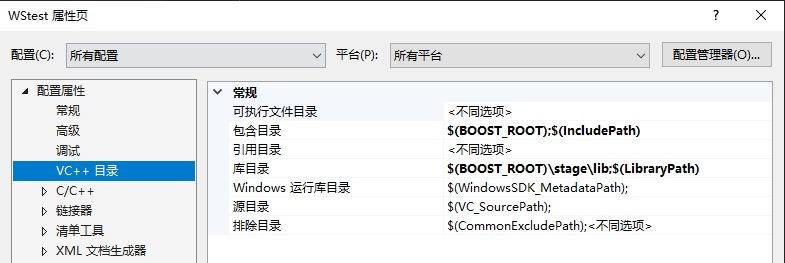

# Web-Server (1) ---- Asio 快速入门

A simple and fast HTTP server implemented using C++17 and Boost.Asio.

从零开始实现一个基于 `C++17` 和 `Boost.Asio` 并且简单快速的HTTP服务器。

---

**这篇文章主要用于`Asio`的快速入门。**

---

## 环境准备

这个项目只依赖`C++17`和 `Boost.Asio`，所以可以很容易的做到跨平台，为了写文档方便，用Windows作为主要的开发平台（后期会部署到Linux中），开发环境使用宇宙第一IDE `Visual Studio 2019`。

先介绍一下Asio，官网对Asio的定义是： Boost.Asio is a cross-platform C++ library for network and low-level I/O programming that provides developers with a consistent asynchronous model using a modern C++ approach.

简单来说，`Boost.Asio`是用于网络和底层`I/O`编程的跨平台`C++`库，它使用现代`C++`方法为开发人员提供一致的异步模型。`C++20`标准库的 networking 部分将是基于Asio，足以说明该库在网络编程中的影响力。

### Boost.Asio 的安装

Asio 依赖于 boost，所以直接安装boost即可。但是由于Asio使用实在太广泛了，所以现在也有了独立版本，在编译的时候定义宏`ASIO_STANDALONE`即可。为了简便，我们直接安装 boost。

安装boost很简单，直接在[官网](www.boost.org) 下载最新的安装包即可，现在的版本是`1.74.0`。

下载完成后解压，对于windows版本，直接运行在安装根目录中的`bootstrap.bat`文件来生成编译boost的工具`b2`。

生成`b2` 以后，在cmd中或者powershell中运行就能开始对boost的编译。

如果我们需要编译 `x86` 和 `x64` 两种平台，可以给 b2 命令行加上个参数：

```powershell
.\b2.exe --address-model=64
```

如果只需要Asio相关的依赖，可以用以下命令

```powershell
.\b2 --with-system --with-thread --with-date_time --with-regex --with-serialization stage
```

稍等片刻，一般10分钟内可以编译完毕。

### Boost配置

第一步是在环境变量中添加`BOOST_ROOT`，指向的是`boost`的根目录`boost_1_74_0`

或者直接使用命令

```powershell
setx BOOST_ROOT ${PATH}\boost_1_74_0
```

第二步是在visual studio项目设置中配置相关的路径，
打开一个工程的属性页

```powershell
Include Directories 中加 $(BOOST_ROOT)
Library Directories 中加 $(BOOST_ROOT)\stage\lib
```

完成以后效果如图：



至此环境准备就完成了。

## Asio初步

使用一些例子来学习一门语言或者是库总是最快最有效的入门方法，这个小结就讲一下简单的Asio例子

下面的例子均来源于[官方教程](https://www.boost.org/doc/libs/1_74_0/doc/html/boost_asio/tutorial.html)

### Hello world

Using a timer synchronously

```c++
#include <iostream>
#include <boost/asio.hpp>
int main()
{
    // 所有使用asio的程序都必须至少具有一个 I/O execution context，可以是io_context或thread_pool对象。
    // 以完成提供对io功能的访问。这里首先声明一个io_context类型的对象。
    // 其实io_context 可以看作事件循环，是整个框架的基础设施
    boost::asio::io_context io;

    // 有了io_context以后，使用其他对象完成相应的IO功能，比如此处用一个steady_timer来完成计时器功能
    // steady_timer 的第一个参数为io_context的引用，第二个参数为计时器到期时间。
    boost::asio::steady_timer t(io, boost::asio::chrono::seconds(5));
    // 我们对计时器执行阻塞等待。直到计时器到期（在创建计时器后5秒）（而不是wait开始时起），对steady_timer :: wait（）的调用才会返回。
    t.wait();
    std::cout << "Hello, world!" << std::endl;

    return 0;
}
```

函数执行效果是5秒后输出结果，然后返回。

---

这里在穿插一个point，有人说Asio内部有锁，导致牺牲了很多性能，其实：

> 有锁这个是事实，以后是多核的天下，多线程本来就是主流，作为高性能的库，以多线程为默认场景这个是可以接受的。但是在使用ASIO时，如果确定只用单线程，只要在构造io_context时传入参数1，即可。像这样：
>
> asio::io_context context(1); // one thread
>
>只要设置了参数1，所有lock和unlock都会被if语句跳过，相当于是无锁，不要小看了单线程哦，异步编程的单线程性能那可是相当之高。

---

### Using a timer asynchronously

下面讲一个异步调用的例子，有关**回调函数**的概念，可以在知乎上搜索。

需要注意的是要在调用run之前要给io_context塞一些工作，如果没有工作，run会立即返回。

```c++

void print(const boost::system::error_code& /*e*/)
{
    std::cout << "Hello, world!" << std::endl;
}

// 使用asio的异步回调功能，从而对计时器执行异步等待
int main()
{
    boost::asio::io_context io;
    boost::asio::steady_timer t(io, boost::asio::chrono::seconds(5));

    // async_wait函数执行异步等待。print作为回调处理程序（传入函数的指针）
    t.async_wait(&print);

    // 必须在io_context对象上调用io_context::run()成员函数。
    // asio库可确保仅从当前正在调用io_context::run()的线程中调用回调处理程序。
    // 因此，除非调用io_context::run()函数，否则永远不会调用异步等待完成的回调。
    std::cout << "I'm Hear! " << std::endl;
    io.run();
    // 在这个例子中run的作用是对计时器的异步等待，所以一直会运行到计时器t到期且回调完成才会返回
    // 所以要在调用run之前给io_context塞一些工作，如果没有工作，run会立即返回。

    return 0;
}
```

### Binding arguments to a handler

为回调函数绑定一些参数，将计时器设为每秒触发一次

这个小节用到一些**绑定**相关的知识，如果不懂可以自行搜索，或者看看 C++ primer

```c++
#include <iostream>
#include <boost/asio.hpp>
#include <boost/bind/bind.hpp>

void print(const boost::system::error_code& /*e*/, boost::asio::steady_timer* t, int* count)
{
    if (*count < 5)
    {
        std::cout << *count << std::endl;
        ++(*count);

        //将计时器的到期时间从上一个到期时间起移一秒。
        //通过计算新的过期时间（相对于旧的过期时间），
        //我们可以确保计时器不会由于处理程序的任何延迟而偏离整秒的标记。
        t->expires_at(t->expiry() + boost::asio::chrono::seconds(1));
        t->async_wait(boost::bind(print,boost::asio::placeholders::error, t, count));
    }
}

//将计时器设为每秒触发一次
int main()
{
    boost::asio::io_context io;

    int count = 0;
    boost::asio::steady_timer t(io, boost::asio::chrono::seconds(1));

    //回调函数中更改计时器的过期时间，然后启动新的异步等待 (回调函数中调用wait) 。
    //print需要添加两个参数，一个是timer object，另一个是count计数器
    t.async_wait(boost::bind(print, boost::asio::placeholders::error, &t, &count));
    // placeholders 就是一个参数占位符而已

    //run函数在没有更多work可完成时就返回。
    io.run();

    std::cout << "Final count is " << count << std::endl;

    return 0;
}
```

### Using a member function as a handler

使用类的成员函数来完成上一个例子。

可以这样写：
（需要注意的是`bind(&printer::print, this)`这种写法，其实很简单，既然是成员函数，则调用的时候会隐含一个this指针，所以以直接绑定到成员函数中就行，返回一个可调用对象）

```c++
class printer
{
public:
    printer(boost::asio::io_context& io) : timer_(io, boost::asio::chrono::seconds(1)), count_(0)
    {
        timer_.async_wait(boost::bind(&printer::print, this));
    }

    ~printer()
    {
        std::cout << "Final count is " << count_ << std::endl;
    }

    void print()
    {
        if (count_ < 5)
        {
            std::cout << count_ << std::endl;
            ++count_;

            timer_.expires_at(timer_.expiry() + boost::asio::chrono::seconds(1));

            // 由于所有非静态类成员函数都有一个隐式this参数，因此我们需要将此参数绑定到该函数。
            // bind将成员函数 转换为可以调用的函数对象（传入this指针）
            // 和上一个例子相比，可以不用 boost :: asio :: placeholders :: error占位符
            timer_.async_wait(boost::bind(&printer::print, this));
        }
    }

private:
    // 下划线是 Google Coding Style 里主张的： Data members are lowercase and always end with a trailing underscore
    boost::asio::steady_timer timer_;
    int count_;
};


//如何使用类的成员函数作为回调处理程序。

// 效果和上一个例子一样，不同之处在于，它现在对类数据成员进行操作，而不是将计时器和计数器作为参数传入。
int main()
{
    boost::asio::io_context io;
    // steady_timer 和 count都是类的成员
    printer p(io);
    io.run();

    return 0;
    // 退出时p析构
}
```

### 在多线程程序中同步处理程序

上面已经讲过，asio保证回调函数的执行一定是在调用run的线程中，但是如果我们拥有多个线程调用io_context :: run（），运行速度可能会快，但是可能存共享线程不安全资源的问题，我们需要一种同步方法，strand 类可以一定程度上解决这个问题。

先看一段代码：

```c++
class printer
{
public:
    printer(boost::asio::io_context& io)
        : strand_(boost::asio::make_strand(io)),
        timer1_(io, boost::asio::chrono::seconds(3)),
        timer2_(io, boost::asio::chrono::seconds(1)),
        count_(0)
    {
        // boost :: asio :: bind_executor（）函数返回一个新的handler，该handler通过strand对象自动分派其包含的handler。
        // 通过将handler绑定到同一strand，我们确保它们不能同时执行( 没有规定先后顺序，只保证不同时)。
        timer1_.async_wait(boost::asio::bind_executor(strand_, boost::bind(&printer::print1, this)));
        timer2_.async_wait(boost::asio::bind_executor(strand_, boost::bind(&printer::print2, this)));
    }

    ~printer()
    {
        std::cout << "Final count is " << count_ << std::endl;
    }

    void print1()
    {
        if (count_ < 10)
        {
            std::cout << "Timer 1: " << count_ << std::endl;
            ++count_;

            timer1_.expires_at(timer1_.expiry() + boost::asio::chrono::seconds(3));
            timer1_.async_wait(boost::asio::bind_executor(strand_, boost::bind(&printer::print1, this)));
        }
    }

    void print2()
    {
        if (count_ < 10)
        {
            std::cout << "Timer 2: " << count_ << std::endl;
            ++count_;

            timer2_.expires_at(timer2_.expiry() + boost::asio::chrono::seconds(1));
            timer2_.async_wait(boost::asio::bind_executor(strand_, boost::bind(&printer::print2, this)));
        }
    }

private:
    boost::asio::strand<boost::asio::io_context::executor_type> strand_;
    boost::asio::steady_timer timer1_;
    boost::asio::steady_timer timer2_;
    // count_ 和 std::out 为共享资源
    int count_;
};

// 演示如何使用strand类模板在多线程程序中同步回调处理程序
// 使用多线程很简单，需要一个调用io_context :: run（）的线程池。
// 但是，由于这允许处理程序并发执行，因此当处理程序可能正在访问共享的线程不安全资源时，我们需要一种同步方法。

// strand类模板是一个执行程序(executor)适配器，该适配器确保对于通过它调度的那些函数(handler)，以一定的先后顺序执行。
// 无论调用io_context :: run（）的线程数如何，都可以保证这一点。
// 当然，这些handler可能仍可与未通过strand分配或通过其他strand分配的其他handler并发执行。
int main()
{
    boost::asio::io_context io;
    printer p(io);
    // 注意只有一个io_context 和一个printer 所以使用多线程并不会加快程序的等待时间
    // 只是处理回调函数print的时候可以由不同的线程执行(加一个strand保证不是同时执行,但是也能在不同线程中执行)
    boost::thread t(boost::bind(&boost::asio::io_context::run, &io));
    io.run();
    t.join();

    return 0;
}
```

运行结果如下如所示：


>上面的代码是单 io_service 多线程模式时 io_service 的典型用法，在这种模式下，多个线程会竞争 io_service，竞争到的线程会得到处理下一个 handler 的机会，通过这种用法，表现为 io_service 会自动的将 io 事件分配给各个线程去处理，并且我们自己的任务也可以通过 io_service.post() 丢给线程们去执行，这相当于我们拥有了一个线程池。
>
>io_service 本身是线程安全的，多个线程在竞争 io_service 时会加锁，然而这只是在竞争 io_service 时加锁，在任何一个线程拿到 io_service 并开始执行 handler 后，io_service 的锁会释放交给其他线程继续竞争。所以可以看到，handlers 是多线程并发执行的，在各个 handlers 中如果存在共享的数据，我们仍是需要处理同步问题。
>
>为此 io_service 提供了 strand，strand 可以用来包裹 handlers，被同一个 strand 包裹的 handlers 会串行执行，这样就可以省的我们自己在 handlers 为共享数据加锁了。实际上，当我们只在一个线程上执行 io_service.run() 时，所有的 handlers 也是通过一个 strand 串行执行的，这在 asio 文档中被称为 "implicit strand".  可以想象，如果我们在多线程单 io_service 的用法下，对所有 handlers 使用同一个 strand 包裹，那么这些 handlers 也将全部串行执行，这将和单线程单 io_service 没有区别，多线程在这种情况下就没有意义了。另外要注意 strand 是属于某个 io_service 的，也就是说 strand 只能串行化它属于的 io_service 下的 handlers。

---

至此Asio的基础我们已经有了一定的了解，先告一段落。

下一小节将学习一些用Asio编写的实用的例子。
