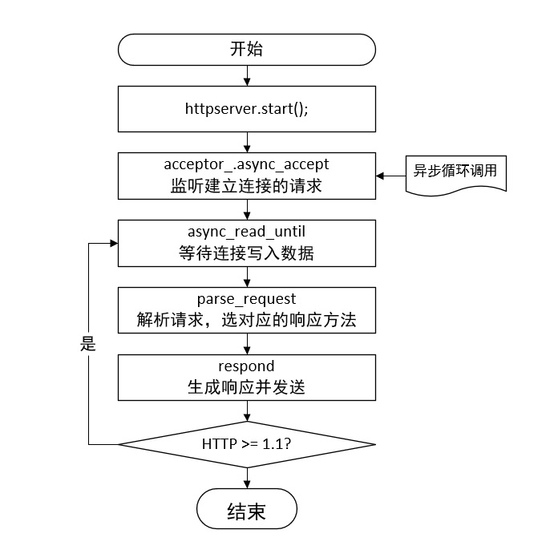
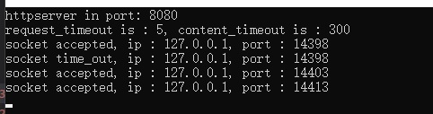

# Web-Server ---- HTTP 服务器

A simple and fast HTTP server implemented using C++17 and Boost.Asio.

从零开始实现一个基于 `C++17` 和 `Boost.Asio` 并且简单快速的HTTP服务器。

---

## HTTP 服务器 v0.5 改动说明

v0.5 功能更新 2020年9月29日

1. 超时设置，建立的连接如果一段时间没新动作，则将该连接销毁。
2. debug信息输出，利用VS中定义的 _DEBUG 宏，在DEBUG模式下会自动输出一些连接信息
3. no dealy 选项，在默认的情况下,Nagle算法是默认开启的，比较适用于发送方发送大批量的小数据，这样可以降低包的传输个数。但是不适用于需要实时的单项的发送数据并及时获取响应的时候，需要将其关掉。

## 连接超时自动销毁

在v0.4版本中，有一个一个BUG，设置HTTP为持久连接的时候**没有设置到期时间**，每个连接的请求都不会销毁，一直在监听，在请求人数较多的时候容易将资源耗尽。

其实解决办法很简单，在执行异步等待的前，比如执行`async_read_until`和`async_read`前设置一个计时器timer，timer和socket绑定，它的的回调函数写为将对应的socket关闭即可。

为了不同场合设置不同的时间，可以写一个函数：

```c++
shared_ptr<deadline_timer> HTTPServer::set_socket_timeout(shared_ptr<ip::tcp::socket> socket, size_t time) {
    std::shared_ptr<deadline_timer> timer(new deadline_timer(io_));
    timer->expires_from_now(boost::posix_time::seconds(time));
    timer->async_wait([socket](const boost::system::error_code& ec) {
        if (!ec) {
            socket->shutdown(ip::tcp::socket::shutdown_both);
            socket->close();
        }
    });
    return timer;
}
```

该函数的第一个参数为要监视的socket，第二个参数为设置的超时时间。

在这个项目中，一共设置了两种超时情况，

第一种是`request_timeout_`，用于已经接受到一个建立请求，等待请求发送后续数据，如果时间超过`request_timeout_`，则将`socket`关闭，`request_timeout_`设置的时间为5秒。对于已经建立的请求，如果处理完毕后在`request_timeout_`时间后没有新的请求，则将该socket关闭。

第二种是`content_timeout_`，用于传输`Content`的超时时间。考虑到网络情况比较复杂，且有些`Content`内容比较长，所以`content_timeout_`默认设置为300秒。

通过这两个超时时间基本解决了持久连接在请求人数较多的时候容易将资源耗尽的问题。

根据实际情况可以设置为其他值，只需要修改配置文件即可。

## debug信息完善

在`visual studio`中，如果是调试模式，则会定义一个宏`_DEBUG`，

所以我们可以将运行时要打印的信息放在这里。

```c++
#ifdef _DEBUG
            std::cout << "socket time_out, ip : "<< socket->remote_endpoint().address().to_string() << ", port : " << socket->remote_endpoint().port() <<std::endl;
#endif // _DEBUG
```

现阶段debug信息只有连接建立和连接销毁的信息（包括ip和端口号）

## no_dealy 选项

在介绍no_dealy 选项之前，先介绍一下Nagle算法。

>在使用一些协议通讯的时候，比如Telnet，会有一个字节字节的发送的情景，每次发送一个字节的有用数据，就会产生41个字节长的分组，20个字节的IP Header 和 20个字节的TCP Header，这就导致了1个字节的有用信息要浪费掉40个字节的头部信息，这是一笔巨大的字节开销，而且这种Small packet在广域网上会增加拥塞的出现。
>
>如果解决这种问题？ Nagle就提出了一种通过减少需要通过网络发送包的数量来提高TCP/IP传输的效率，这就是Nagle算法
>
>Nagle算法的规则（可参考tcp_output.c文件里tcp_nagle_check函数注释）：  
>（1）如果包长度达到MSS，则允许发送；  
>（2）如果该包含有FIN，则允许发送；  
>（3）设置了TCP_NODELAY选项，则允许发送；  
>（4）未设置TCP_CORK选项时，若所有发出去的小数据包（包长度小于MSS）均被确认，则允许发送；  
>（5）上述条件都未满足，但发生了超时（一般为200ms），则立即发送。  

Nagle算法主要是避免发送小的数据包，要求`TCP`连接上最多只能有一个**未被确认的小分组**，在该分组的确认到达之前不能发送其他的小分组。相反，`TCP`收集这些少量的小分组，并在确认到来时以一个分组的方式发出去。Nagle算法只允许一个未被ACK的包存在于网络，它并不管包的大小，因此它事实上就是一个扩展的停-等协议，只不过它是基于包停-等的，而不是基于字节停-等的。Nagle算法完全由TCP协议的ACK机制决定，这会带来一些问题，比如如果对端ACK回复很快的话，Nagle事实上不会拼接太多的数据包，虽然避免了网络拥塞，网络总体的利用率依然很低。

在默认的情况下，`Nagle`算法是默认开启的，适用于发送方发送大批量的小数据，并且接收方作出及时回应的场合，这样可以降低包的传输个数。

当你的应用不是连续请求+应答的模型的时候，而是需要实时的单项的发送数据并及时获取响应，这种情况就明显和Nagle算法的原理相悖，会产生不必要的延迟。

关闭`Nagle`算法很简单，在新建连接的时候用两行代码设置一下就行。

```c++
ip::tcp::no_delay option(true);
socket->set_option(option);
```

## 大致框架



## 结果展示

