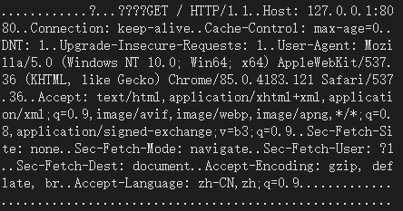
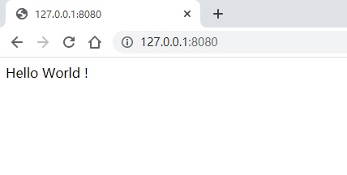

# Web-Server ---- HTTP 服务器

A simple and fast HTTP server implemented using C++17 and Boost.Asio.

从零开始实现一个基于 `C++17` 和 `Boost.Asio` 并且简单快速的HTTP服务器。

---

**这篇文章用一个使用 `boost/asio`开发的简单HTTP服务器。**

和上一版本的异步`daytime`服务器一样，分为两个类，第一个是管理HTTP连接的类`HttpServer`，第二个类为`HttpConnection`，作用是处理具体的HTTP请求和响应。

---

## HttpServer 类

该类中有两个数据成员，第一个是`asio::io_context& io_`;注意为引用类型。第二个是`asio::ip::tcp::acceptor acceptor_`用于监听连接。

构造函数中调用`start_accept`，开始监听连接。

监听连接的时候，需要建一个`HttpConnection`对象，并使用**智能指针**管理该对象。

回调函数为`handle_accept`,用于处理收到的连接。

具体代码为：

```c++
class HttpServer
{
public:
    HttpServer(asio::io_context& io, asio::ip::tcp::endpoint ep) : io_(io), acceptor_(io, ep) {
        start_accept();
    }

private:
    void start_accept()
    {
        // 用智能指针管理对象
        HttpConnection::pointer new_connection = HttpConnection::create(io_);
        // 这里的bind形式也可以改为lambda表达式
        acceptor_.async_accept(new_connection->socket(), boost::bind(&HttpServer::handle_accept, this, new_connection,
            boost::asio::placeholders::error
        ));
    }
    void handle_accept(HttpConnection::pointer new_connection,
        const boost::system::error_code& error) {
        if (!error)
        {
            new_connection->start();
        }
        else {
            std::cerr << "err in handle_accept:" << error.message() << std::endl;
        }

        start_accept();
    }

    asio::io_context& io_;  //引用类型
    asio::ip::tcp::acceptor acceptor_;
};
```

## HttpConnection 类

由于全程使用指针指针管理`HttpConnection`对象，所以需要继承`boost::enable_shared_from_this<HttpConnection>`类。

并且还需将构造函数设为`private`的，且用一个`create`函数创建对象，返回智能指针。

当`HttpServer`类监听到请求以后，会调用`HttpConnection`的`start`函数。

在 中，使用 `async_read_until`全局函数接受`socket_`中的数据，放到`request_`中。然后调用回调函数`handle_read_until`分析请求，用`async_write`全局函数发送响应。

```c++
class HttpConnection : public boost::enable_shared_from_this<HttpConnection>
{
public:
    typedef boost::shared_ptr<HttpConnection> pointer;

    static pointer create(boost::asio::io_context& io_context)
    {
        return pointer(new HttpConnection(io_context));
    }

    asio::ip::tcp::socket& socket() { return socket_; }

    void start()
    {
        asio::async_read_until(socket_, asio::dynamic_buffer(request_), "\r\n\r\n",
            boost::bind(&HttpConnection::handle_read_until, shared_from_this(),
                boost::asio::placeholders::error));
    }

private:
    HttpConnection(boost::asio::io_context& io) : socket_(io) {}

    void handle_read_until(const boost::system::error_code& err) {
        if (err)
        {
            std::cerr << "err in handle_read_until:" << err.message() << std::endl;
            return;
        }
        std::string first_line = request_.substr(0, request_.find("\r\n")); // should be like: GET / HTTP/1.0
        std::cout << first_line << std::endl;

        char str[] = "HTTP/1.0 200 OK\r\n\r\n<html> Hello World ! </html>";
        asio::async_write(socket_, asio::buffer(str), boost::bind(&HttpConnection::handle_write,
            shared_from_this(),
                boost::asio::placeholders::error,
                    boost::asio::placeholders::bytes_transferred));
    }

    void handle_write(const boost::system::error_code& /*error*/, size_t /*bytes_transferred*/)
    {
        socket_.close();
    }

    asio::ip::tcp::socket socket_;
    std::string request_;
};
```

最后，写一个`main`函数来启动循环即可。

```c++
int main()
{
    using asio::ip::tcp;
    try {
        asio::io_context io;
        HttpServer hs(io, tcp::endpoint(tcp::v4(), 8080));
        io.run();
    }
    catch(std::exception& e){
        std::cerr << e.what() << std::endl;
    }
    return 0;
}
```

## 结果

可以看到，使用谷歌浏览器发送的请求为(内存中的视图)：



返回的响应在浏览器中显示为：


