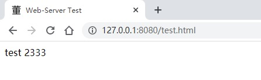
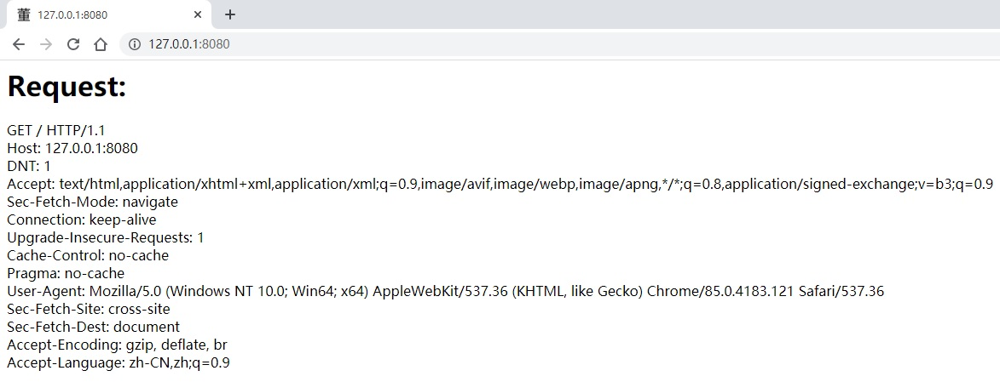
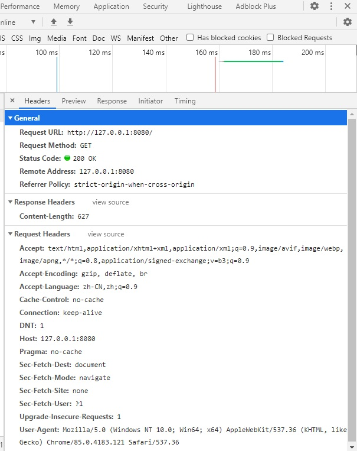

# Web-Server ---- HTTP 服务器

A simple and fast HTTP server implemented using C++17 and Boost.Asio.

从零开始实现一个基于 `C++17` 和 `Boost.Asio` 并且简单快速的HTTP服务器。

---

## HTTP 服务器 v0.4 改动说明

在[上一个版本中v0.3](https://github.com/dongzj1997/Web-Server/tree/v0.3)中，我们使用`HTTP`连接的类`HttpServer`，处理具体的HTTP请求和响应的类为`HttpConnection`，实现了一个简单的`HTTP`服务器。

但是功能还不是很完善，只能处理简单的请求和返回简单的文本，在这篇文章中，继续把缺少的补齐。

主要有：

1. 程序启动的时候从配置文件中读取相应的参数，用到`boost/property_tree`中的`ptree`和`json_parser`这两个头文件。

2. 使用多线程来运行`io_.run();`

3. 可以处理`GET`,`POST`等多种请求（使用了`unordered_map<string, function<void(ostream&, const Request&, const smatch&)>>`的数据结构）。

4. 增加了对文件的请求（v0.3版本中只能返回字符串，不能返回文件）

5. 增加了出错处理和提示，比如404等错误。

6. 支持`HTTP1.1`或者以上的版本，使用持久连接，在发送完毕收据后不立即销毁socket，而是等待其他数据请求。

7. 将头文件和源文件分开，结构更清晰，并且较前一版大量使用`lambda`表达式来替代`bind`对象作为回调函数，更直观。

---

具体实现：

## 从配置文件中读取相应的参数

配置文件的格式为JSON，既方便人为的读取和修改，又方便程序处理。

但是C++标准库中没有特别用于处理`JSON`格式的库，既然网络部分使用的是`Boost`，那么处理`JSON`也直接用`Boost`中的`property_tree`就行。

`property_tree`中做`JSON`相关的处理主要用到`ptree`和`json_parser`这两个头文件。

`ptree`主要是定义一个数据结构，类似于树的结构，可以理解为一个嵌套的字典。`pt.get<unsigned short>("port");` 表示将`pt`中的`port`键对应的值以`unsigned short`的方式读取并返回。

`json_parser`主要的作用是将`JSON`文件按找一定的方式读取出来。`read_json(ss, pt);`表示将文件`ss`按照`JSON`格式读取到`pt`中去。

使用十分方便。考虑到文件格式可能有误，使用 `try-catch`将解析`JSON`的过程包装起来。

```c++
std::stringstream ss;
ss << config.rdbuf();
config.close();
try {
    boost::property_tree::ptree pt;
    read_json(ss, pt);

    port = pt.get<unsigned short>("port");
    num_threads = pt.get<size_t>("num_threads");
}
catch (const std::exception& e) {
    std::cerr << e.what() << std::endl;
}
```

## 使用多线程来运行`io_.run();`

在类中定义一个数据结构`std::vector<std::thread> threads_;`

然后创建类的时候，使用多个线程来运行`io_.run();` **asio保证回调函数的执行一定是在调用run的线程中**

由于多个线程直线没有要共享且要修改的对象，所以暂时不用考虑加锁或者使用`strand`的问题。

实现方式很简单

```c++
void HTTPServer::start() {
    accept();

    // 根据 num_threads 创建多个 run 线程
    for(size_t c = 1; c < num_threads_; c++) {
        threads_.emplace_back([this](){
            io_.run();
        });
    }

    io_.run();

    // 启动其他线程
    for(std::thread& t: threads_) {
        t.join(); // -> io_.run();
    }
}
```

## 请求匹配操作

在程序中，现阶段一共匹配两种请求，方法都为`GET`。

第一种没有具体的路径,只有一个主机名+端口号，比如 127.0.0.1:8080，HTTP中的请求为`GET / HTTP/1.1`。

第二种为对具体文件的请求,只有一个主机名+端口号+文件，比如 127.0.0.1:8080/test.html，HTTP中的请求为`GET /test.html HTTP/1.1`。

使用正则表达式匹配。

第一种只有一个`/`正则表达式为`""^/$""`，第二种为`"^/.+$"`表示以`/`开头，后面至少还有一个字符。

将这些请求和对应的方法放入``unordered_map<string, function<void(ostream&, const Request&, const smatch&)>>``中（或者使用vector）

在处理具体请求时，遍历容器，如果正则表达式匹配，则调用相应的函数（或者其他可调用对象）。

> 可调用对象包括：函数，函数指针，lambda表达式，bind创建的对象，仿函数（重载了函数调用运算符的类）等待。

## 对文件的请求和出错处理

对文件的请求几乎是`HTTP`中最常用的操作了。

这部分的逻辑比较简单，先判断文件路径是否合法，这里使用`std::distance`和`std::equal`两个函数，确保请求的文件在规定的目录下。

```c++
// 确保目录还在 web_root_path 下
if (std::distance(web_root_path.begin(), web_root_path.end()) > std::distance(path.begin(), path.end()) ||
    !std::equal(web_root_path.begin(), web_root_path.end(), path.begin()))
    throw std::invalid_argument("path must be within root path");
```

然后尝试打开文件，如果文件不存在，抛出一个错误。

将文件读到`std::stringstream`中，然后转移到`response`中，并返回。

如果文件不存在或者其他原因造成打开失败，则直接返回404和一个字符串。

！ 注意这里都是一次读取，后续可以考虑换位**分多次读取并返回**。

## 关于HTTP1.1

> HTTP协议的初始版本中，每次进行一次通信都要断开一次TCP连接。但是由于传输信息量的增大(如一个页面里有多张图片请求)，每次请求都造成的无谓TCP连接建立和断开，增加了通信量的开销。
> 因此，为解决上述TCP连接的问题，提出了持久连接（或HTTP keep-alive）方法。特点是只要任意一端没有明确提出断开连接，则保持TCP连接状态。
> 持久连接的好处在于减少了 TCP 连接的重复建立和断开所造成的额外开销，减轻了服务器端的负载。另外，减少开销的那部分时间，使 HTTP 请求和响应能够更早地结束，这样 Web 页面的显示速度也就相应提高了。
> 在 HTTP/1.1 中，所有的连接默认都是持久连接，但在 HTTP/1.0 内并未标准化。虽然有一部分服务器通过非标准的手段实现了持久连接，但服务器端不一定能够支持持久连接。毫无疑问，除了服务器端，客户端也需要支持持久连接

要将常规的连接换成持久连接十分简单，在之前的代码中，新建一个socket，在发送结束后，该socket对象会销毁。

在HTTP1.1中，发送完一批数据之后，不将socket销毁，而是调用`process_request_and_respond(socket);`函数，该函数又调用`async_read_until(*socket,...)`函数继续等待请求的输入。

通过这样即可保持连接。

但是这里还有一个BUG，**没有设置到期时间**，每个连接的请求都不会销毁，一直在监听，在请求人数较多的时候容易将资源耗尽，这在未来的版本中会修正。

## 大致框架


## 结果展示

在exe的根目录下建一个web文件夹，里面放一个`test.html`写几行简单的HTML

```html
<html>
    <head>
        <title>Web-Server Test</title>
    </head>
    <body>
        test 2333
    </body>
</html>
```

结果如下：



请求不加其他路径，返回请求的详情：



和浏览器中的信息对比



最后，网页左上角的那个小图标是哪来的呢？

其实通过调试发现，谷歌浏览器会自动请求一个`favicon.ico`文件作为网页的图标。

所以新建一个`ico`文件放在资源的根目录下即可。
