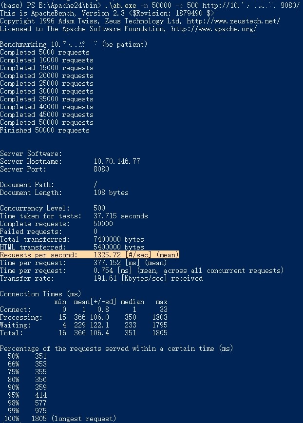
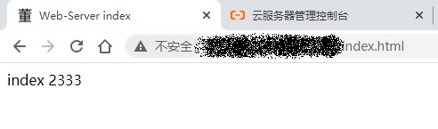

# Web-Server ---- HTTP 服务器

A simple and fast HTTP server implemented using C++17 and Boost.Asio.

从零开始实现一个基于 `C++17` 和 `Boost.Asio` 并且简单快速的HTTP服务器。

大致框架：


---

## HTTP 服务器 v1.0 改动说明

v1.0 压力测试及部署到云 2020年11月29日

1. 使用apache bench进行压力测试，实测在Intel 4.5GHz CPU单线程下每秒可处理1325个请求。
2. 将服务器部署到阿里云（带宽仅为1Mbps，所以图片加载有点慢……）。
3. 写了一个简单的个人空间网站放在了服务器上。

# 压力测试以及部署

做一些简单的压力测试，使用apache自带的压力测试工具apache bench即可，简称ab。

## 基本概念

先了解一些压力测试的基本概念

1. **吞吐率（Requests per second）**  
概念：服务器并发处理能力的量化描述，单位是reqs/s，指的是某个并发用户数下单位时间内处理的请求数。某个并发用户数下单位时间内能处理的最大请求数，称之为最大吞吐率。
计算公式：总请求数 / 处理完成这些请求数所花费的时间，即
Request per second = Complete requests / Time taken for tests

2. **服务器平均请求等待时间（Time per request: across all concurrent requests）**  
计算公式：处理完成所有请求数所花费的时间 / 总请求数，即
Time taken for / testsComplete requests  
它是吞吐率的倒数。
同时，它也=用户平均请求等待时间/并发用户数，即
Time per request / Concurrency Level

3. **并发连接数（The number of concurrent connections）**  
某个时刻服务器所接受的请求数目。

4. **并发用户数（The number of concurrent users，Concurrency Level）**  
一个用户可能同时会产生多个会话，也即连接数。

5. **用户平均请求等待时间（Time per request）**  
即处理完成所有请求数所花费的时间/ （总请求数 / 并发用户数）  
Time per request = Time taken for tests /（ Complete requests / Concurrency Level）

## ab参数说明

命令为`格式：ab [options] [http://]hostname[:port]/path`

参数比较多，详细可以看[官方文档](https://httpd.apache.org/docs/2.4/programs/ab.html)

比较常用的参数如下：

- `-n` requests Number of requests to perform  
在测试会话中所执行的请求个数（本次测试总共要访问页面的次数）。默认时，仅执行一个请求。
- `-c` concurrency  
Number of multiple requests to perform at a time. Default is one request at a time.

- `-C` cookie-name=value  
Add a Cookie: line to the request. The argument is typically in the form of a name=value pair. This field is repeatable.

- `-s` timeout  
Maximum number of seconds to wait before the socket times out. Default is 30 seconds. Available in 2.4.4 and later.

一般情况下，使用`-n`和`-c`就可以了。

## 测试结果

在实验室的服务器上进行测试（Intel Xeon W系列，8C / 16T，3.9~4.5GHz ）

只开单线程，请求数为5万，并发度为500，结果如下：



可以看到，**单线程**下做到了**每秒处理1325个请求**，还是相当不错的。

# 部署到阿里云

开一个学生套餐10￥一月即可。

通过ssh登录阿里云虚拟主机以后，我们还需要做以下工作。

## GCC的升级

在某些应用场景中，需要特定的gcc版本支持，但又不想编译gcc，可以使用红帽提供的开发工具包来管理gcc版本，这样做的好处是随时切换版本，并且可以并存多个版本，不破坏原有gcc环境。

红帽官方Developer Toolset[文档地址](https://access.redhat.com/documentation/en-us/red_hat_developer_toolset/8/)

先安装devtoolset包,然后安装对应版本的devtoolset

```bash
yum install centos-release-scl
yum install devtoolset-4
```

其中devtoolset-4表示的是`gcc5.x.x版本`

其他版本对应如下：

```bash
devtoolset-3对应gcc4.x.x版本
devtoolset-4对应gcc5.x.x版本
devtoolset-6对应gcc6.x.x版本
devtoolset-7对应gcc7.x.x版本
```

激活gcc版本，使其生效

```bash
scl enable devtoolset-4 bash

or

source /opt/rh/devtoolset-4/enable
```

值得注意的是这仅仅在当前bash生效，如果需要永久生效，修改.bashrc 即可。

## 安装boost

```bash
tar -xzvf boost_1_74_0.tar.gz
cd boost_1_74_0
./bootstrap.sh --prefix=/usr/local
./b2 install --with=all
```

## 编译websever

```bash
g++ main.cpp httpserver.cpp -o http -lboost_system -lboost_thread -lpthread -lboost_filesystem
```

## Linux中error while loading shared libraries错误解决办法

默认情况下，编译器只会使用`/lib`和`/usr/lib`这两个目录下的库文件，通常通过源码包进行安装时，如果不指定`--prefix`，会将库安装在`/usr/local/lib`目录下；当运行程序需要链接动态库时，提示找不到相关的`.so`库，会报错。也就是说，`/usr/local/lib`目录不在系统默认的库搜索目录中，需要将目录加进去。

1. 首先打开/etc/ld.so.conf文件

2. 加入动态库文件所在的目录：执行vi /etc/ld.so.conf，在"include ld.so.conf.d/*.conf"下方增加"/usr/local/lib"。

3. 保存后，在命令行终端执行：/sbin/ldconfig -v；其作用是将文件/etc/ld.so.conf列出的路径下的库文件缓存到/etc/ld.so.cache以供使用，因此当安装完一些库文件，或者修改/etc/ld.so.conf增加了库的新搜索路径，需要运行一下ldconfig，使所有的库文件都被缓存到文件/etc/ld.so.cache中，如果没做，可能会找不到刚安装的库。

　　经过以上三个步骤，"error while loading shared libraries"的问题通常情况下就可以解决了。

　　如果运行应用程序时，还是提示以上错误，那就得确认一下是不是当前用户在库目录下是不是没有可读的权限。像我遇到的问题就是，从别的机子拷贝了一些`.so`动态库，然后用root权限放到了`/usr/local/lib`中（普通用户没有对该目录的写权限），然后切换用户运行程序时，始终提示找不到.so库，一直以为是我配置有问题，结果是因为权限原因，那些我用root权限增加到`/usr/local/lib`中的`.so`文件对于普通用户而言，是没有访问权限的，所以以普通用户运行程序，当需要链接`.so`库时，在`/usr/local/lib`中是查找不到的。

　　其实，对于由普通用户自己编译生成的`.so`库文件，比较好的做法是将这些`.so`库文件的路径用`export`指令加入到`~/.bash_profile`中的`LD_LIBRARY_PATH`变量中,`LD_LIBRARY_PATH`是程序运行需要链接`.so`库时会去查找的一个目录，`~/.bash_profile`是登陆或打开shell时会读取的文件，这样，每次用户登录时，都会把这些`.so`库文件的路径写入`LD_LIBRARY_PATH`，这样就可以正常地使用这些`.so`库文件了。

## 运行

编译好后，添加对应的动态库位置，即可运行。

但是对于阿里云ECS，并不是所有端口都可以使用，需要在阿里云管理后台配置安全组规则。


可以看到，阿里默认开放的端口号是3389，我们将服务器的conf.json文件中端口号的参数同样修改为3389即可。

如果想要用其他的端口，修改阿里云管理后台配置安全组规则就行。

比如我们将8080端口加入到规则中，除此之外，可能要需要修改一下防火墙配置

在centos 7 中 防火墙iptables已经由firewalld来管理，所以需要将8080端口添加到防火墙开放端口

> firewall-cmd --zone=public --add-port=8080/tcp --permanent

添加完端口之后，需要重启下防火墙

> systemctl restart firewalld.service

查看端口是否添加到防火墙开放端口

> firewall-cmd --query-port=8080/tcp

最后，我们就可以使用配置好的端口在任意地方访问网站了。



---

## HTTP 服务器 v0.5 改动说明

v0.5 功能更新 2020年9月29日

详情点击[这里](https://github.com/dongzj1997/Web-Server/tree/v0.5)

1. 超时设置，建立的连接如果一段时间没新动作，则将该连接销毁。
2. debug信息输出，利用VS中定义的 _DEBUG 宏，在DEBUG模式下会自动输出一些连接信息
3. no dealy 选项，在默认的情况下,Nagle算法是默认开启的，比较适用于发送方发送大批量的小数据，这样可以降低包的传输个数。但是不适用于需要实时的单项的发送数据并及时获取响应的时候，需要将其关掉。

---

## HTTP 服务器 v0.4 改动说明

详情点击[这里](https://github.com/dongzj1997/Web-Server/tree/v0.4)

在[上一个版本中v0.3](https://github.com/dongzj1997/Web-Server/tree/v0.3)中，我们使用`HTTP`连接的类`HttpServer`，处理具体的HTTP请求和响应的类为`HttpConnection`，实现了一个简单的`HTTP`服务器。

但是功能还不是很完善，只能处理简单的请求和返回简单的文本，在这篇文章中，继续把缺少的补齐。

主要有：

1. 程序启动的时候从配置文件中读取相应的参数，用到`boost/property_tree`中的`ptree`和`json_parser`这两个头文件。

2. 使用多线程来运行`io_.run();`

3. 可以处理`GET`,`POST`等多种请求（使用了`unordered_map<string, function<void(ostream&, const Request&, const smatch&)>>`的数据结构）。

4. 增加了对文件的请求（v0.3版本中只能返回字符串，不能返回文件）

5. 增加了出错处理和提示，比如404等错误。

6. 支持`HTTP1.1`或者以上的版本，使用持久连接，在发送完毕收据后不立即销毁socket，而是等待其他数据请求。

7. 将头文件和源文件分开，结构更清晰，并且较前一版大量使用`lambda`表达式来替代`bind`对象作为回调函数，更直观。

---

## HTTP 服务器 v0.3 简单的HTTP服务器实现

第一个可用版本，详情点击[这里](https://github.com/dongzj1997/Web-Server/tree/v0.3)

1. 实现了`HttpServer`类，用于管理HTTP连接
2. 实现了`HttpConnection`类，用于处理具体的HTTP请求和响应。
3. 使用异步IO方式，全程使用**智能指针**管理该对象。

---

## HTTP 服务器 v0.2 Sockets 编程初步

用一个使用asio开发的简单daytime客户端和服务器程序来让我们快速了解Sockets编程的相关知识和Asio中相关库的使用。详情点击[这里](https://github.com/dongzj1997/Web-Server/tree/v0.2)

1. 介绍了什么是daytime服务，如何启动等等
2. 用Asio编写一个synchronous 的 TCP daytime **客户端**，并测试
3. 用Asio编写一个synchronous 的 TCP daytime **服务器**，并测试
4. 用Asio编写一个asynchronous 的 TCP daytime **客户端**，并测试
5. 用Asio编写一个asynchronous 的 TCP daytime **服务器**，并测试
6. 使用UDP实现上面的内容。
7. 总结**Asio**中常用的类于方法。

---

## HTTP 服务器 v0.1  Asio 快速入门

自己总结的Asio快速入门教程，详情点击[这里](https://github.com/dongzj1997/Web-Server/tree/v0.1)

主要有：

1. 环境准备
2. Boost.Asio 的安装、配置
3. 简单的同步、异步语句
4. 回调函数，bind等详细说明
5. 多线程程序中同步处理程序（strand）
6. Asio中用到的类介绍

---
