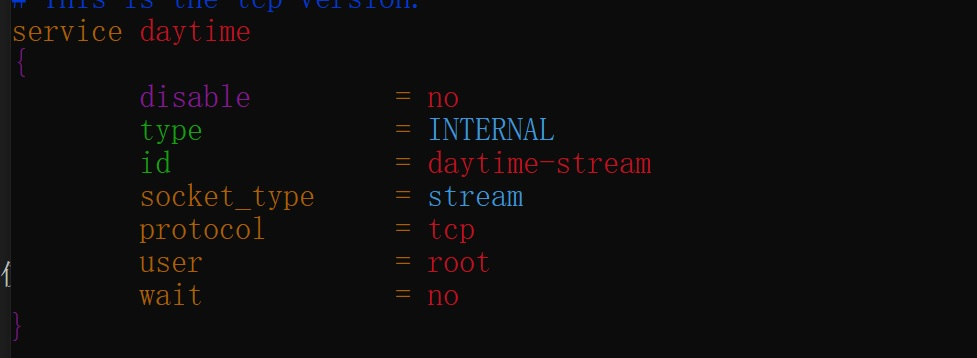

# Web-Server (2) ---- Sockets 编程初步

A simple and fast HTTP server implemented using C++17 and Boost.Asio.

从零开始实现一个基于 `C++17` 和 `Boost.Asio` 并且简单快速的HTTP服务器。

---

**这篇文章用一个使用`asio`开发的简单`daytime`客户端和服务器程序来让我们快速了解`Sockets`编程的相关知识和`Asio`中相关库的使用。**

---

## 关于daytime服务

### 什么是daytime服务

维基百科中对daytime服务的描述是：

> The Daytime Protocol is a service in the Internet Protocol Suite, defined in 1983 in RFC 867. It is intended for testing and measurement purposes in computer networks.
>
>A host may connect to a server that supports the Daytime Protocol on either Transmission Control Protocol (TCP) or User Datagram Protocol (UDP) port 13. The server returns an ASCII character string of the current date and time in an unspecified format.

简单来说，daytime基于TCP或者UDP的一个应用，端口都是13，一般用于网络的调试，它的作用是返回当前时间和日期的字符串。

格式为：dd mmm yy hh:mm:ss zzz

比如：20 SEP 2020 21:54:44 CST

## 如何启动daytime服务

在linux系统中，可以方便的启动该服务，可以使用以下命令

```sh
# 安装xinetd，如果为Contos 或者红帽系系列，可以使用yum
# 如果提示xinetd找不到，可以先用sudo apt update  更新一波
sudo apt install xinetd

# 执行该命令后会在/etc/xinetd.d/目录下生成一些配置文件
# 用vim打开，前面的一行的 “disable=yes”改为“disable=no”，如有需要，对UDP版本的也做同样的修改。
vim ./daytime

# 重启该服务
service xinetd restart
```

效果如下图所示：





## 用Asio编写一个synchronous 的 TCP daytime 客户端

代码如下：

```c++
#include <iostream>
#include <boost/array.hpp>
#include <boost/asio.hpp>

using boost::asio::ip::tcp;

int main(int argc, char* argv[])
{
    try
    {
        // 参数只有一个，即为daytime服务器的ip地址，对应argv[1]
        // argv[0] 指向程序运行的全路径名
        if (argc != 2)
        {
            std::cerr << "Usage: client <host>" << std::endl;
            return 1;
        }

        boost::asio::io_context io_context;

        // 使用resolver将 参数指定的服务器名称转换为TCP端点，参数为  host名 + 服务协议名
        tcp::resolver resolver(io_context);
        // results_type类型其实是一个类似vector的东西，因为一个host可能对应多个ip（v4，v6）
        tcp::resolver::results_type endpoints = resolver.resolve(argv[1], "daytime");

        // 创建并连接socket。上面获得的端点列表可能同时包含IPv4和IPv6端点，因此我们需要尝试每个端点，直到找到可行的端点为止。
        // connect函数自动为我们执行此操作。
        tcp::socket socket(io_context);
        boost::asio::connect(socket, endpoints);

        //连接已打开。读取daytime服务的响应即可
        for (;;)
        {
            // 使用boost::array来保存接收到的数据。 char []或vector也可
            // buffer函数可以自动确定数组的大小，防止缓冲区溢出。
            boost::array<char, 128> buf;
            boost::system::error_code error;
            // read_some的返回值为读取数据的大小
            size_t len = socket.read_some(boost::asio::buffer(buf), error);

            if (error == boost::asio::error::eof)
                break; // 数据读完，跳出循环
            else if (error)
                throw boost::system::system_error(error); // Some other error.

            std::cout.write(buf.data(), len);
        }
    }
    catch (std::exception& e)
    {
        std::cerr << e.what() << std::endl;
    }

    return 0;
}
```

现在客户端的程序已经写好了，我们需要找一个daytime服务器来测试一下

在win10中，我们可以使用WSL2很容易的完成，安装方法这里不写了，比较简单。

在wsl中按照文章最开始的步骤启动daytime服务器，获得WSL的ip地址，这个就是我们需要填入的参数（注意一般是一个B类的内网保留地址，`172.16.0.0`-`172.31.255.255`，子网掩码是`255.240.0.0`）

配置好后，编译运行，在shell中或者在IDE中都可以，需要注意的是，如果在IDE中，需要人为的加入参数，按照下图的方式：


运行的结果如图(分别为IDE中和shell中)：


## 用Asio编写一个synchronous 的 TCP daytime 服务器

### 获取字符串格式的时间 & ctime的问题

官方教程中给的例子在VS2019中编译不过，原因是一个与ctime有关的问题。

```c++
std::string make_daytime_string()
{
  using namespace std; // For time_t, time and ctime;
  time_t now = time(0);
  return ctime(&now);
}
```

```log
 C4996 'ctime': This function or variable may be unsafe. Consider using ctime_s instead. To disable deprecation, use _CRT_SECURE_NO_WARNINGS.
```

ctime 这个函数作用是传入一个`time_t`类型的参数，返回我们常用的字符串格式的时间。编译器提示这个函数是不安全的，不安全在哪呢？

查找相关资料可以知道，该函数返回指向静态数据的指针，并且不是线程安全的。另外，它修改了可以与`gmtime`和`localtime`共享的静态tm对象。 `POSIX`将该功能标记为过时的，并建议使用`strftime`。

并且对于某些time_t值，导致字符串长度超过25个字符（例如，年份10000），造成内存溢出。

解决这个问题，有两种方法，第一种是定义一个宏，直接忽视这个错误

```c++
#define _CRT_SECURE_NO_WARNINGS
```

另一种是使用一些安全的函数，如`strftime`，`put_time`，`ctime_s`等等。

这些函数一般要求我们自己提供一块内存作为参数。修改以后如下：

```c++
std::string make_daytime_string()
{
    char s[50] = {0};
    using namespace std; // For time_t, time and ctime;
    time_t now = time(0);
    ctime_s(s, sizeof(s), &now);
    // return ctime(&now);
    return s;
}
```

### synchronous 的 TCP daytime sever

可以这也编写：注意synchronous表示服务器一直在等待客户端请求，如果没有请求，则一直阻塞。

阻塞发生在`acceptor.accept(socket);`这一步。

```c++
int main()
{
    try
    {
        boost::asio::io_context io_context;

        // 创建一个acceptor对象来侦听新的连接。它初始化为侦听TCP端口13（用于IP版本4）
        tcp::acceptor acceptor(io_context, tcp::endpoint(tcp::v4(), 13));

        for (;;)
        {
            // 同步服务器，将一次处理一个连接。创建一个套接字，它将表示与客户端的连接，然后等待连接。
            tcp::socket socket(io_context);

            // 如果没有客户端创建socket，则程序一直阻塞在这一步等待
            acceptor.accept(socket); // 阻塞的方式

            std::string message = make_daytime_string();

            boost::system::error_code ignored_error; // 如果正常的话 ignored_error 的值是 system:0
            boost::asio::write(socket, boost::asio::buffer(message), ignored_error);
            // 运行到这里，出了代码块以后socket会销毁，连接关闭
        }
    }
    catch (std::exception& e)
    {
        std::cerr << e.what() << std::endl;
    }

    return 0;
}
```

运行效果如下：


## 用 Asio 编写一个 asynchronous 的 TCP daytime 服务器

### tcp_connection类

这里为了完成我们的工作，定义两个类，第一个类是负责建立连接，发送数据的类，类名为`tcp_connection`, 主要的成员有两个，第一个是`tcp::socket socket_`，第二个是存有要发送数据的string`std::string message_`。只有一个函数`start`，在函数start中,调用async_write将数据提供给客户端。不调用async_write_some以确保发送了整个数据块。

为了符合面向对象的程序特征，我们**禁止通过自带的构造函数**来构造`tcp_connection`类。具体做法是将构造函数声明为私有即可。

```c++
private:
    // 构造函数声明为私有，所以只能通过create创建tcp_connection对象
    tcp_connection(boost::asio::io_context& io_context)
        : socket_(io_context){}
```

于此同时，我们用一个create方法来构造`tcp_connection``对象，返回值为一个智能指针，为了直观类型重新声明为pointer`。

```c++
    typedef boost::shared_ptr<tcp_connection> pointer;

    static pointer create(boost::asio::io_context& io_context)
    {
        return pointer(new tcp_connection(io_context));
    }
```

整体代码和注释为：

注意这里用到`enable_shared_from_this`：

如果一个`T`类型的对象`t`，是被`shared_ptr`管理的，且类型T继承自`enable_shared_from_this`，那么`T`就有个`shared_from_this`的成员函数，这个函数返回一个新的`shared_ptr`的对象，也指向对象`t`。

这里用的是`boost::enable_shared_from_this`， `C++11`以后在`std`中也有该类。

为什么不用`this`指针呢：

使用智能指针的初衷就是为了方便资源管理，如果在某些地方使用智能指针，某些地方使用原始指针，很容易破坏智能指针的语义，从而产生各种错误。

可以直接传递`share_ptr<this>`吗？

答案是不能，因为这样会造成2个非共享的share_ptr指向同一个对象，未增加引用计数导对象被析构两次。

```c++
std::string make_daytime_string()
{
    char s[50];
    using namespace std; // For time_t, time and ctime;
    time_t now = time(0);
    ctime_s(s, sizeof(s), &now);
    // return ctime(&now);
    return s;
}


// 继承enable_shared_from_this和使用shared_ptr的作用是：只要有引用它的操作，我们就希望tcp_connection对象保持活动状态。
class tcp_connection : public boost::enable_shared_from_this<tcp_connection>
{
public:
    typedef boost::shared_ptr<tcp_connection> pointer;

    static pointer create(boost::asio::io_context& io_context)
    {
        return pointer(new tcp_connection(io_context));
    }

    tcp::socket& socket()
    {
        return socket_;
    }

    // 在函数start中,调用async_write将数据提供给客户端。不调用async_write_some以确保发送了整个数据块。
    void start()
    {
        // 要发送的数据存储在类成员message_中，因为我们需要保持数据有效，直到异步操作完成。
        message_ = make_daytime_string();

        boost::asio::async_write(socket_, boost::asio::buffer(message_),
            boost::bind(&tcp_connection::handle_write, shared_from_this(), // shared_from_this() 相当于this指针
                boost::asio::placeholders::error,
                boost::asio::placeholders::bytes_transferred));
    }

private:
    // 构造函数声明为私有，所以只能通过create创建tcp_connection对象
    tcp_connection(boost::asio::io_context& io_context)
        : socket_(io_context)
    {
    }

    // 此客户端连接的所有其他操作都由handle_write 负责。这个程序中不需要其他操作
    void handle_write(const boost::system::error_code& /*error*/,
        size_t /*bytes_transferred*/)
    {
    }

    tcp::socket socket_;
    std::string message_;
};
```

### tcp_server 类

`tcp_server`类的主要作用是管理整个daytime服务，对客户端的每一个请求，可以重复创建`tcp_connection`类来回应。

有两个成员，一个是`io_context` 成员，注意此处没必要新建一个`io_context`,所以声明为**引用**即可。

另一个是`tcp::acceptor acceptor_`, 每一个`tcp_server`对象只需要一个`tcp::acceptor`

出了构造函数之外，还需要一个`start_accept`函数，主要作用是创建一个`socket`并启动异步接受操作以等待新的连接。

在`start_accept`函数中，等待新连接是一个异步操作，所以我们还需要一个回调函数`handle_accept`来执行收到请求后的操作。

`async_accept`为客户端请求提供服务，调用的是`tcp_connection`类中的`start`函数来生成并返回结果，处理完毕后**再次调用**`start_accept()`发起下一个接受操作。

```c++
    void handle_accept(tcp_connection::pointer new_connection,
        const boost::system::error_code& error)
    {
        if (!error)
        {
            new_connection->start();
        }

        start_accept();
    }
```

整个`tcp_server`类的代码和注释如下：

```c++
class tcp_server
{
public:
    tcp_server(boost::asio::io_context& io_context) : io_context_(io_context),
        acceptor_(io_context, tcp::endpoint(tcp::v4(), 13))
    {
        start_accept();
    }

private:
    // 函数start_accept() 创建一个socket并启动异步接受操作以等待新的连接。
    void start_accept()
    {
        // 一个新的new_connection 为即将到来的连接做准备
        tcp_connection::pointer new_connection = tcp_connection::create(io_context_);
        // handle_accept 为类成员函数，需要传入一个this指针当第一个参数
        acceptor_.async_accept(new_connection->socket(),
            boost::bind(&tcp_server::handle_accept, this, new_connection,
                boost::asio::placeholders::error));
    }

    // async_accept的回调函数，如果等到有请求，调用此函数
    // async_accept为客户端请求提供服务，处理完毕后再次调用start_accept（）发起下一个接受操作。
    void handle_accept(tcp_connection::pointer new_connection,
        const boost::system::error_code& error)
    {
        if (!error)
        {
            new_connection->start();
        }

        start_accept();
    }

    boost::asio::io_context& io_context_; // io_context的引用
    tcp::acceptor acceptor_;
};

```

最后在`main`函数中创建`io_context`和`tcp_server`对象，调用`io_context.run()`函数即可。

```c++
int main()
{
    try
    {
        boost::asio::io_context io_context;
        tcp_server server(io_context);
        // 进行异步操作
        io_context.run();
    }
    catch (std::exception& e)
    {
        std::cerr << e.what() << std::endl;
    }

    return 0;
}
```

## UDP相关操作

### UDP daytime 客户端

现在尝试将上面基于TCP的daytime客户端和服务器改为UDP，其实UDP比TCP简单许多，不用显式的建立连接，只需要发送和接受数据即可。

基本用法是先建立一个`socket`，`udp::socket socket(io_context);`

发送数据使用`socket.send_to`函数，接收数据使用`socket.receive_from`，者两个函数的参数都为`buffer`和`endpoint`。

整体代码如下：

```c++
#include <iostream>
#include <boost/array.hpp>
#include <boost/asio.hpp>

using boost::asio::ip::udp;

int main(int argc, char* argv[])
{
    try
    {
        if (argc != 2)
        {
            std::cerr << "Usage: client <host>" << std::endl;
            return 1;
        }

        boost::asio::io_context io_context;

        udp::resolver resolver(io_context);
        udp::endpoint receiver_endpoint = *resolver.resolve(udp::v4(), argv[1], "daytime").begin();

        // 由于UDP是面向数据报的，因此我们将不使用流套接字。直接创建一个socket并启动与远程端点的联系。
        udp::socket socket(io_context);
        socket.open(udp::v4());

        boost::array<char, 1> send_buf = { { 0 } };
        socket.send_to(boost::asio::buffer(send_buf), receiver_endpoint);

        boost::array<char, 128> recv_buf;
        udp::endpoint sender_endpoint;
        // sender_endpoint 会由receive_from填充
        // 服务器怎么知道sender_endpoint端口呢？ 当然是发送UDP数据包中的源端口字段中说明的。
        size_t len = socket.receive_from( boost::asio::buffer(recv_buf), sender_endpoint);

        std::cout.write(recv_buf.data(), len);
    }
    catch (std::exception& e)
    {
        std::cerr << e.what() << std::endl;
    }

    return 0;
}
```

### UDP daytime 服务器

在TCP中，需要建立一个acceptor，对每一个链接，都需要建立一个socket，UDP只需要建一个socket，
和客户端一样，发送数据使用`socket.send_to`函数，接收数据使用`socket.receive_from`，者两个函数的参数都为`buffer`和`endpoint`。

```c++
#define _CRT_SECURE_NO_WARNINGS
#include <ctime>
#include <iostream>
#include <string>
#include <boost/array.hpp>
#include <boost/asio.hpp>
using boost::asio::ip::udp;

std::string make_daytime_string()
{
    using namespace std; // For time_t, time and ctime;
    time_t now = time(0);
    return ctime(&now);
}

int main()
{
    try
    {
        boost::asio::io_context io_context;
        // 在TCP中，需要建立一个acceptor，对每一个链接，都需要建立一个socket，UDP只需要建一个socket
        udp::socket socket(io_context, udp::endpoint(udp::v4(), 13));

        for (;;)
        {
            boost::array<char, 1> recv_buf;
            udp::endpoint remote_endpoint;
            // 等待客户段发送数据，remote_endpoint对象将由receive_from填充（根据客户端发送的源端口）。
            socket.receive_from(boost::asio::buffer(recv_buf), remote_endpoint);

            std::string message = make_daytime_string();

            boost::system::error_code ignored_error;
            socket.send_to(boost::asio::buffer(message), remote_endpoint, 0, ignored_error);
        }
    }
    catch (std::exception& e)
    {
        std::cerr << e.what() << std::endl;
    }

    return 0;
}
```

### asynchronous 的 UDP daytime 服务器

相关代码和`TCP`的流程差不多 这里不再赘述

可以查看本目录下的`daytime_server_asyn_udp.cpp`文件。

此外，还可以将TCP和UDP的服务同时写到一个程序中，一个进程可以绑定多个端口,仅需要修改一下`main`函数即可。

```c++
int main()
{
    try
    {
        // 一个进程可以绑定多个端口
        boost::asio::io_context io_context;
        tcp_server server1(io_context);
        udp_server server2(io_context);
        io_context.run();
    }
    catch (std::exception& e)
    {
        std::cerr << e.what() << std::endl;
    }

    return 0;
}
```

详情可以查看本目录下的 `daytime_server_tcp_udp.cpp`文件。

端口占用如下：


## 总结

`Asio`中常用的类

来源于[某乎](https://zhuanlan.zhihu.com/p/39973955)

| 类名|作用 |
|--|--|
|asio::io_context类  |基础设施，可以看作事件循环。socket、timer都需要它。io_context可以作为应用程序唯一的事件循环，也可以很容易地与qt等现有的event loop集成。  |
|asio::io_context::run()成员函数 | 运行事件循环。|
| asio::ip::tcp::socket类 | socket相关 |
| asio::ip::tcp::acceptor类 | tcp服务器用来接受客户端连接 |
| asio::ip::tcp::endpoint | tcp地址+端口，用作参数 |
|asio::buffer系列类 | buffer，用来缓存需要收发的数据。buffer相关的类是asio中功能非常独立的部分，和其它的功能交集不多 |
| acceptor::async_accept成员函数 | 接受一个连接。注意只有一个。如果要接受多个，在回调函数中再次调用此函数 |
| socket::async_read_some成员函数 | 接收一次数据，收到多少是多少 |
| socket::async_write_some成员函数| 发送一次数据，需要发的数据未必一次就可以发完。|
| asio::async_read全局函数|读取指定字节数的数据。这个函数是asio对socket.async_read_some的高级封装，在很多场合用这个函数可以节省很多代码。|
|asio::async_read_until全局函数 |读取数据直到满足某个条件为止。 |
|asio::async_write全局函数 | 发送指定字节的数据，直到发完为止。|
| | |
